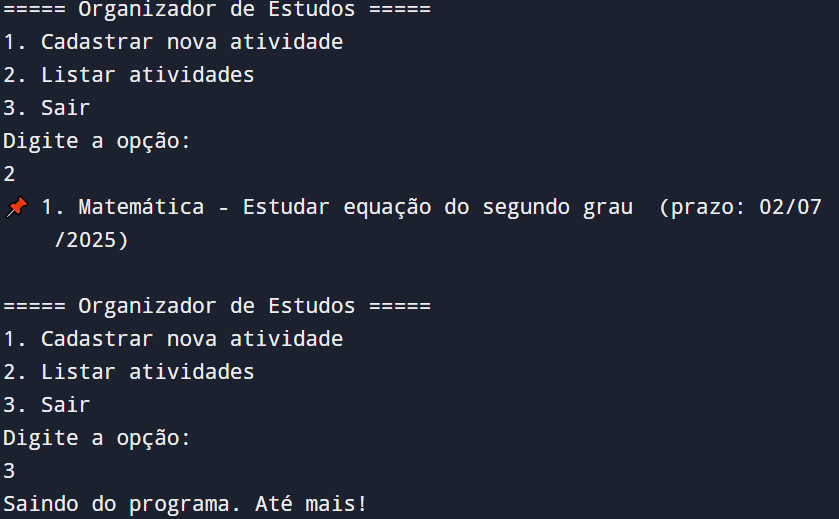

# 📚 Organizador de Estudos em Swift

Este projeto é um organizador de estudos criado com a linguagem Swift, pensado para ajudar estudantes a se manterem organizados com suas atividades escolares e prazos. Agora com suporte a **banco de dados local em `.json`**!

Repositório oficial: [Isaac-M-M/organizadorEstudos](https://github.com/Isaac-M-M/organizadorEstudos)

---

## 🗺️ Roteiro do Projeto Final

### 1️⃣ Ponto de Partida: Ideia e Plano

- **Problema real:**  
  Muitos estudantes têm dificuldade em se organizar, o que leva à perda de prazos e queda de rendimento.
- **Objetivo da aplicação:**  
  Criar um organizador de estudos em Swift que permita registrar atividades, organizar tarefas e salvar dados localmente em JSON.

---

### 2️⃣ Mão na Massa: Codificação

- **Linguagem:** Swift  
- **Condicionais:** `if`, `switch`, `guard` para validar dados e controlar fluxos.  
- **Repetições:** `while` e `for` para interações com listas e menus.  
- **Vetores e matrizes:** Uso de arrays de `Atividade` (struct) para representar e manipular dados.  
- **Funções:** O código está dividido em funções organizadas para melhor legibilidade e manutenção.

---

### 3️⃣ Teste, Teste e Mais Teste!

- Foram realizados testes manuais de cadastro, listagem e salvamento em JSON.  
- Erros de entrada inválida foram tratados com validações (por exemplo, campos em branco).  
- Parte do código pode ser testada no [Programiz Swift Online](https://www.programiz.com/swift-programming/online-compiler).

---

### 4️⃣ Documentação no GitHub

- Este `README.md` fornece todas as instruções de execução, explicação do código e estrutura de arquivos.  
- O projeto conta com um guia em PDF explicando cada parte do código: [`GuiaComentadoDeAprendizadoEmSwiftComProjeto.pdf`](./GuiaComentadoDeAprendizadoEmSwiftComProjeto.pdf).  
- Autor registrado: Isaac M. M.

---

### 5️⃣ Conclusão e Próximos Passos

- **Aprendizados:**  
  - Estruturação de um sistema completo com Swift,  
  - Uso de JSON para persistência,  
  - Organização lógica por módulos.
- **Desafios:**  
  - Implementação de leitura/escrita segura de arquivos,  
  - Validações robustas de entrada de dados.
- **Melhorias Futuras:**  
  - Implementar ordenação por prazo;  
  - Criar uma interface gráfica multiplataforma (ex.: Python/Tkinter ou SwiftUI);  
  - Exportar dados em PDF ou CSV para relatórios.

---

## 🛠️ Tecnologias Utilizadas

- **Linguagem:** Swift  
- **Persistência:** Arquivo local `atividades.json` (via `Codable`)  
- **Terminal:** Execução em linha de comando (CLI)  
- **Testes Parciais:** Programiz Swift Online (para lógica, sem persistência de arquivos)  
- **Versão:** Swift 5.x  
- **Versionamento:** Git + GitHub

---

## 🧾 Estrutura de Arquivos no Repositório

```
📁 organizadorEstudos/
├── atividades.json                        # Banco de dados com as atividades
├── organizador_estudos_com_json.swift     # Código principal do projeto
├── Guia_Completo_Swift_Comentado.pdf      # Guia detalhado do projeto
├── README.md                              # Documentação deste projeto
├── screenshot1.png                        # Print ao cadastrar atividade
└── screenshot2.png                        # Print ao listar atividade
```

---

## 🧭 Passo a Passo para Rodar o Programa

### 🖥️ 1. Verifique se você tem o Swift instalado

No terminal (Windows PowerShell, CMD, Terminal do Mac ou Linux):

```bash
swift --version
```

Se não tiver instalado, baixe e instale por aqui:  
🔗 https://swift.org/download/

---

### 📂 2. Baixe os arquivos do projeto

Você pode fazer isso de duas formas:

✅ **A. Via Git (recomendado):**

```bash
git clone https://github.com/Isaac-M-M/organizadorEstudos.git
cd organizadorEstudos
```

✅ **B. Via download ZIP no GitHub:**

1. Acesse o repositório: [https://github.com/Isaac-M-M/organizadorEstudos](https://github.com/Isaac-M-M/organizadorEstudos)  
2. Clique em `Code > Download ZIP`  
3. Extraia o conteúdo e abra a pasta extraída no terminal.

---

### ▶️ 3. Execute o programa

Com todos os arquivos na mesma pasta, execute:

```bash
swift organizador_estudos_com_json.swift
```

---

### 📁 4. Sobre o arquivo `atividades.json`

- O programa cria e atualiza automaticamente esse arquivo.  
- Ele serve como **banco de dados local** para armazenar as atividades cadastradas.  
- Se quiser apagar todos os dados, basta deletar o arquivo `atividades.json`.

> 💻 **Execução no Programiz (Parcial)**  
> Você pode testar partes do código (cadastro, estruturas de decisão, repetição) no [Programiz Swift Online](https://www.programiz.com/swift-programming/online-compiler).  
> **Observação:** o Programiz não permite leitura/escrita de arquivos, então o arquivo `atividades.json` não será carregado lá, mas toda a lógica em Swift pode ser testada normalmente.

---

## 🖼️ Demonstração

### 1. Cadastrando uma nova atividade



### 2. Listando atividades cadastradas


---

## 👥 Equipe

- **Isaac M. M.** — Desenvolvedor e idealizador do projeto  
- **ChatGPT (OpenAI)** — Apoio técnico e geração de documentação

---

## 📄 Licença

Este projeto é distribuído sob a licença MIT. Uso educacional livre.

---

## 🔎 Referências

- [Documentação Oficial do Swift](https://swift.org/documentation/)  
- [Programiz Swift Tutorial](https://www.programiz.com/swift-programming)  
- [Apple Swift Language Guide](https://developer.apple.com/documentation/swift)  
